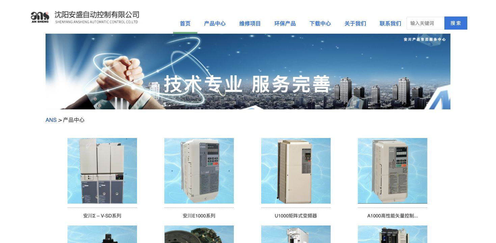
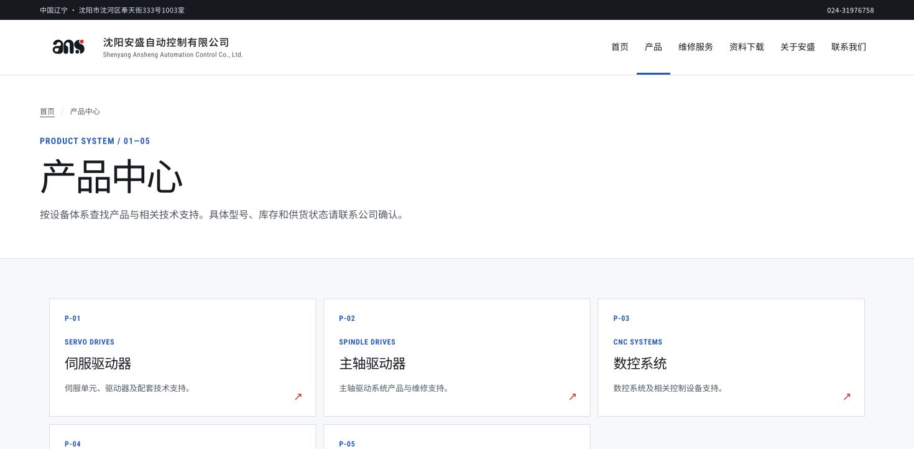
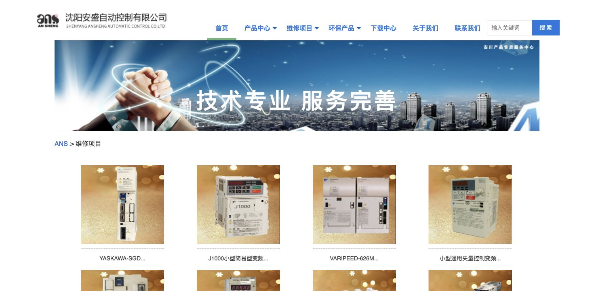
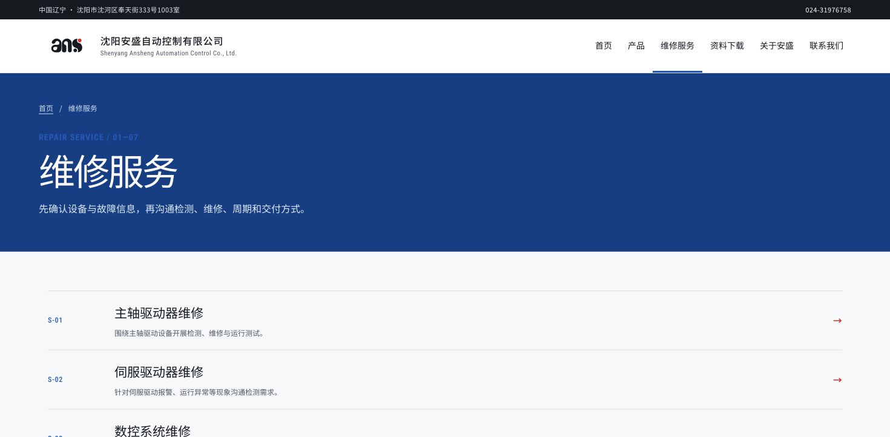
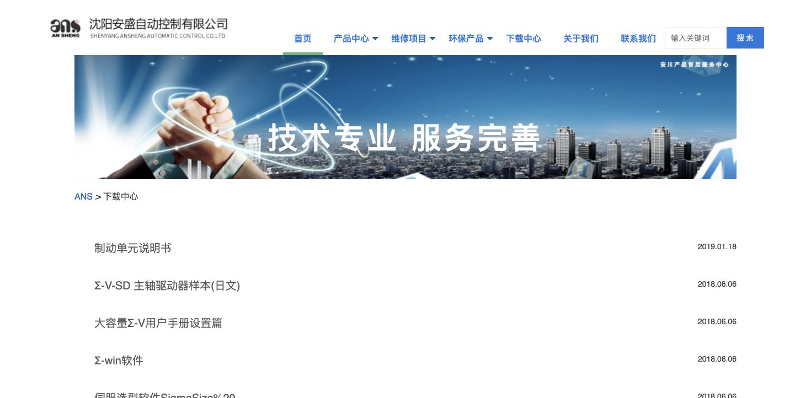
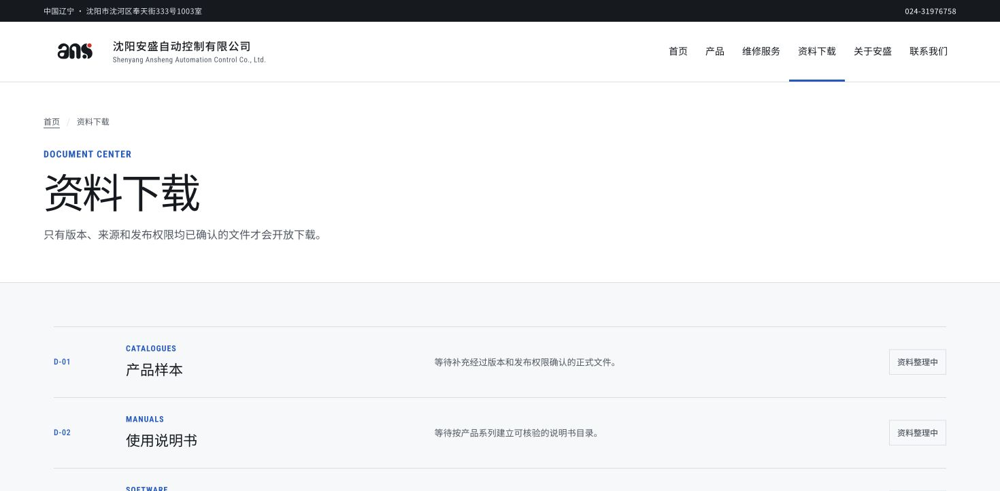
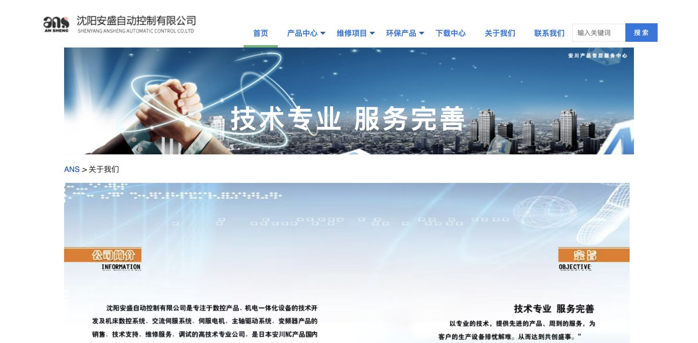
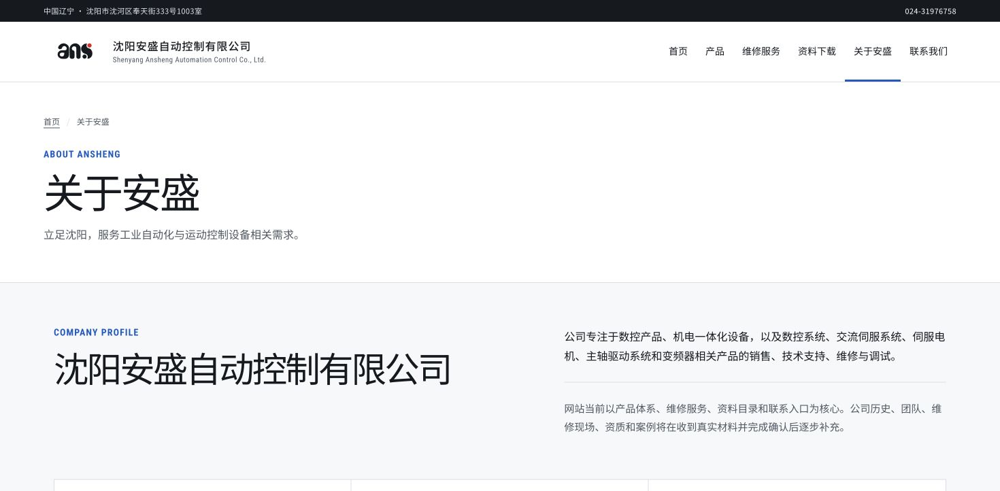
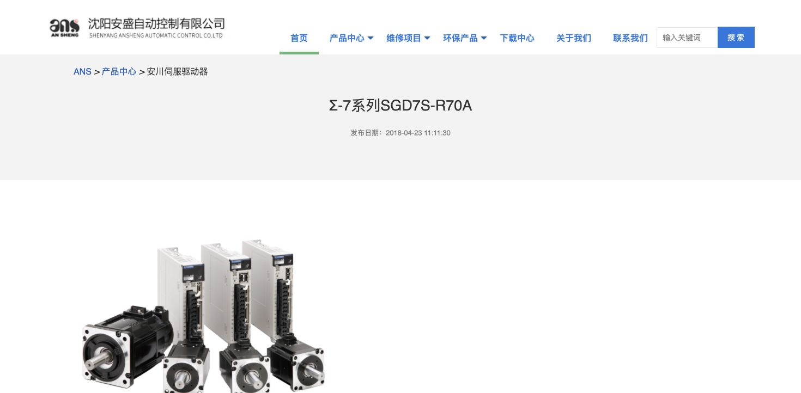
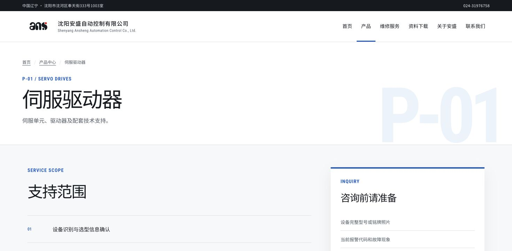

# My AI Workflow in Practice

## Bringing modern technology to a traditional industrial website

This case study documents how I used AI to research, plan, build, review, and validate a real website in an industry outside my primary background.

The goal was not to present myself as a front end designer. My role was to direct the full workflow: understand the business, define constraints, turn incomplete source material into structured requirements, guide AI through implementation, and verify every deliverable before release.

**Live result:** [stevewei.ca/lab/syans](https://stevewei.ca/lab/syans)

## System transformation

The homepage alone does not explain the upgrade. The following comparisons show how the same operating principles were applied across the complete information system.

### Product system

| Before | After |
| --- | --- |
|  |  |
| Products were presented as a long image catalogue with limited hierarchy. | Products are organized into five stable categories with codes, summaries, and consistent detail routes. |

### Repair service system

| Before | After |
| --- | --- |
|  |  |
| Repair services reused promotional product cards and truncated labels. | Seven service types are presented as a clear operational directory. |

### Document system

| Before | After |
| --- | --- |
|  |  |
| Historical files appeared as a date based download list. | Documents are grouped by purpose and remain unavailable until version, source, and publication rights are confirmed. |

### Company information

| Before | After |
| --- | --- |
|  |  |
| Company information was embedded in a decorative graphic and dense text. | Confirmed information is presented as readable content, while missing history, team, and case material remains explicitly incomplete. |

### Product detail template

| Before | After |
| --- | --- |
|  |  |
| Individual records depended on isolated images and publication dates. | A reusable template combines category identity, service scope, and inquiry preparation. |

The transformation was more than a visual refresh. The original site treated many pages as promotional posters or disconnected records. The new version treats the website as an efficient industrial information system.

## The challenge

The source website contained useful business information, but it was mixed with outdated presentation patterns, incomplete assets, repeated content, and unclear navigation. I also needed to work in industrial automation, a field I had not previously studied in depth.

I used AI as a working system rather than a one step generator.

## My AI workflow

```text
Business need
    ↓
Source audit
    ↓
Requirement and constraint definition
    ↓
Structured content model
    ↓
AI task planning
    ↓
Implementation and iteration
    ↓
Human review
    ↓
Automated and visual validation
    ↓
Versioned delivery
```

### 1. Understand the domain

I reviewed the existing site, business categories, service structure, contact paths, and available assets. AI helped accelerate terminology research and content comparison, while final interpretations remained subject to human review.

### 2. Define the truth boundary

I separated confirmed information from missing material. The workflow explicitly prohibited invented product images, fake customer claims, fabricated technical specifications, and substitute QR codes.

### 3. Convert the website into structured data

Products, services, navigation, company information, material gaps, and interface actions were converted into reviewable data files. This reduced inconsistency and made the site easier to migrate or update.

### 4. Direct implementation

I provided the objectives, priorities, content rules, visual constraints, and acceptance criteria. AI supported code generation and iteration. I reviewed the output and redirected the work whenever the result was unclear, excessive, or unsupported.

### 5. Validate the result

The final release was checked across 18 routes and five viewport widths. Validation covered navigation, responsive behavior, content accuracy, interaction states, build output, missing materials, and browser errors.

## What I decided

AI accelerated execution, but the following decisions remained mine:

- What information the company actually needed to communicate
- What source material was reliable enough to publish
- Which missing materials should remain visibly absent
- How products and services should be organized
- What counted as a successful release
- When the interface was concise enough to stop iterating

## Evidence of delivery

- 18 implemented routes
- Desktop, tablet, and mobile layouts
- Structured product, service, navigation, and company data
- Documented material gaps
- Versioned migration snapshots
- File integrity checks using SHA 256
- Build and deployment validation
- Published working result

## Outcome

This project demonstrates how I approach unfamiliar work with AI:

> I define the problem, structure the workflow, direct the tools, challenge the output, and remain accountable for the final result.

The result is a practical example of modern technology helping a traditional industrial business communicate with greater clarity and efficiency.

## Repository guide

- [`docs/workflow.md`](docs/workflow.md) explains the operating workflow.
- [`docs/decisions.md`](docs/decisions.md) records important human decisions.
- [`docs/validation.md`](docs/validation.md) summarizes the quality checks.
- [`website/`](website/) contains a curated implementation snapshot.

## Scope and transparency

This is a curated public case study. Private AI conversations, local machine paths, platform credentials, generated build files, unapproved company materials, personal contact pages, and unrelated personal website code are intentionally excluded. Screenshots contain only public business information visible on the company websites.
